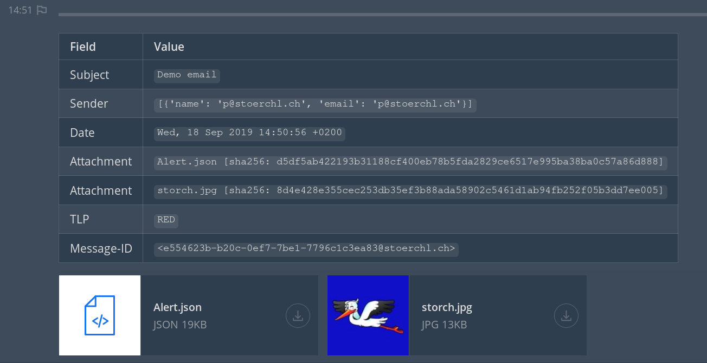

# Mail 2 Mattermost

A python daemon which listens for incoming email messages and pushes them to a defined Mattermost channel.
The current version pushes all incoming emails to Mattermost.
With minor modifications other filter conditions can be written directly inside `mail2mattermost.py`.
Probably I'll add further filter functionaility to this project at some point.

An email post inside Mattermost could look as follows:


### Installation and Configuration

This project uses the library `imbox` to listen for incoming email messages. (https://github.com/martinrusev/imbox).
All needed dependencies can be installed using the following command:

```sh
pip3 install -r requirements.txt
```

All needed configuration have to be made inside the file `mail2mattermost.conf`.
With adding multiple sections inside the configuration files, multiple email inboxes can be listened to.

With the `mail_*` configurations inside the config file it is possible to define which email fields will be pushed to Mattermost.

### Usage

To start all the daemons the following command can be used.

```sh
python3 mail2mattermost.py start mail2mattermost.conf
```

To stop or restart the daemons the corresponding keywords are available. (stop, restart)

License
----
GNU GPLv3
